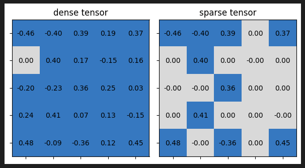
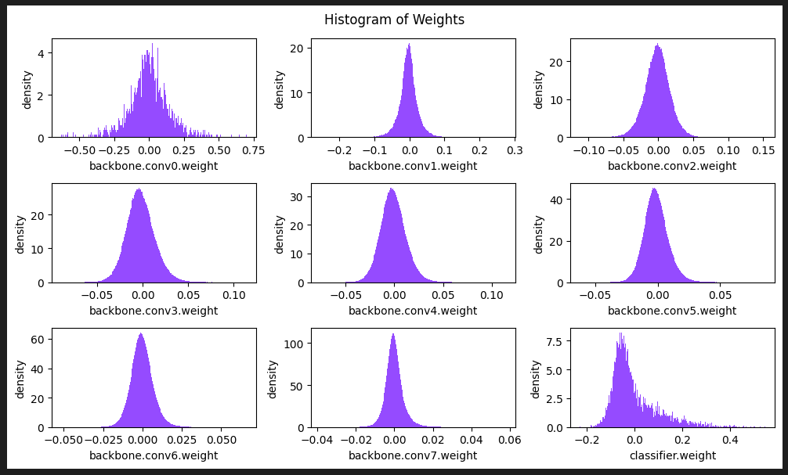
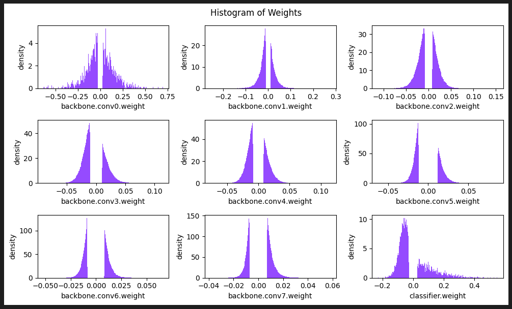
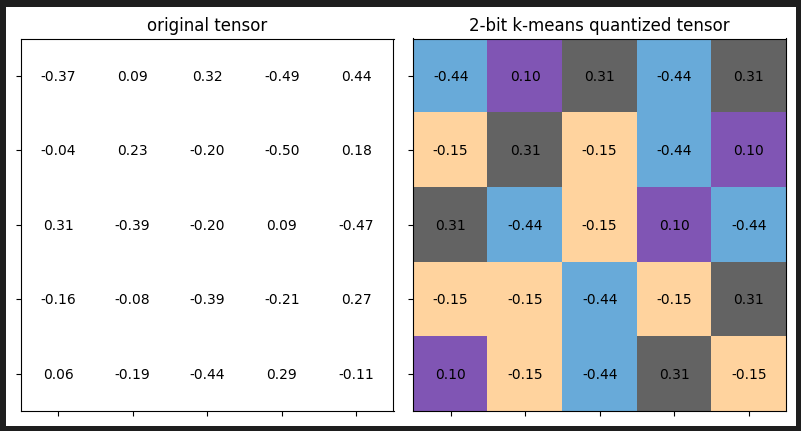

# Pruning-and-Quantization

This project involves the implementation of the Pruning and Quantization of VGG16 Network for Image Classification of CIFAR10. The pruning techniques used are fine-grained pruning and channel pruning. K-means quantization is implemented and applied to the model after that. To see the detailed working of these model optimization techniques, check the code [here](./P&Q_ntbk.ipynb). 

## Network Architecture 

## Pruning Visualization

<table>
  <tr>
      <td align = "center">  </td>
  </tr>
  <tr>
      <td align = "center"> Fine Grained Pruning </td>
  </tr>
</table>

<table>
  <tr>
      <td align = "center">  </td>
      <td align = "center">  </td>
  </tr>
  <tr>
      <td align = "center"> Before Pruning </td>
      <td align = "center"> After Pruning </td>
  </tr>
</table>

## Quantization Visualization

<table>
  <tr>
      <td align = "center">  </td>
  </tr>
  <tr>
      <td align = "center"> K-means Quantization </td>
  </tr>
</table>